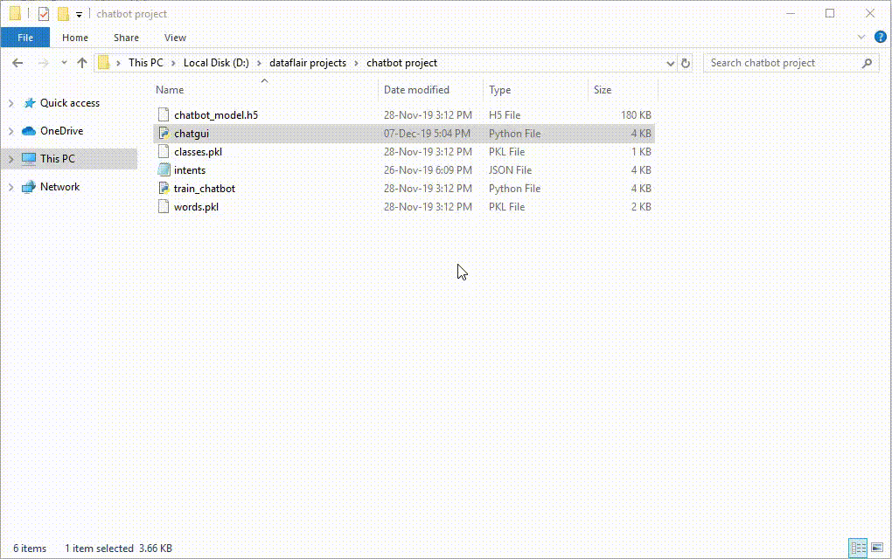

# A-Simple-Chartbot 🤖✨

A Simple Chatbot 🤖A simple, beginner-friendly conversational chatbot built in Python that handles basic text-based queries. It's designed to be an easy-to-understand starting point for anyone interested in building their own chatbot.A chatbot is a software application used to conduct an online chat conversation via text or text-to-speech, in lieu of providing direct contact with a live human agent. Designed to convincingly simulate the way a human would behave as a conversational partner, chatbot systems typically require continuous tuning and testing.

✨ FeaturesConversational: Engages in basic back-and-forth dialogue.Text-Based: Handles simple text queries with predefined responses.Customizable: Easily extend the conversation logic with new rules.Beginner-Friendly: A straightforward and minimal codebase perfect for learning.🔹 Installation & UsageGetting the chatbot up and running is simple.Clone this repository:git clone https://github.com/subhadipsinha722133/A-Simple-Chatbot.git
cd A-Simple-Chatbot
- Install dependencies:pip install -r requirements.txt
- Run the chatbot:python chatbot.py
- 💬 Example ConversationHere is a sample interaction with the chatbot:You: Hello
- Bot: Hi there! How can I help you?

- You: What is your name?
- Bot: I am your friendly Python chatbot.

You: Bye
Bot: Goodbye!
📂 Project StructureThe project directory is organized as follows:A-Simple-Chatbot/
├── chatbot.py        # Main chatbot script
├── requirements.txt  # Project dependencies
└── README.md         # Documentation
🚀 Future ImprovementsThis project can be extended with more advanced features, such as:Add NLP models (like NLTK or spaCy) for better language understanding.Integrate with speech recognition and text-to-speech engines.Deploy as a web or mobile application.👨‍💻 Authorsubhadipsinha722133✨ A simple yet powerful starting point for building your own chatbot!

Deploy as a web or mobile chatbot

👨‍💻 Author

subhadipsinha722133

✨ A simple yet powerful starting point for building your own chatbot!
